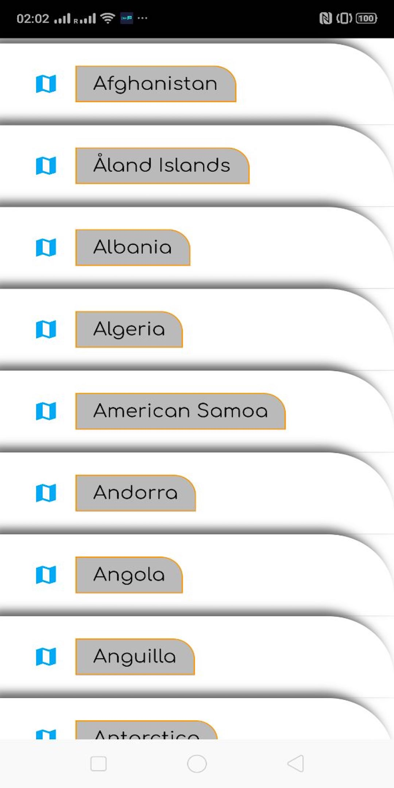
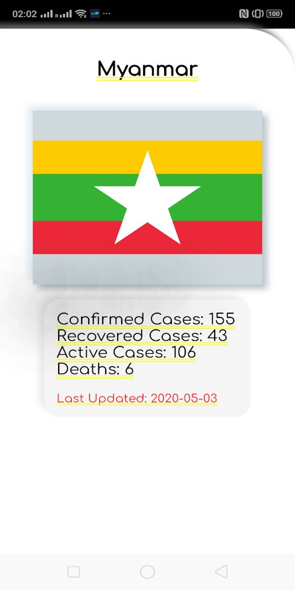

# Dead Simple Covid ## Written in Dart and Flutter (Naing)

An application that provides latest known information on Covid 19 Status.
This app makes use of the following dependencies that are also listed in pubspec.yaml file. 

* flutter_spinkit: ^3.1.0 | Displaying loading indication
* clay_containers: ^0.2.2 | Neumorphic design elements
* http: ^0.11.3+16 | http post/get request
* flutter_svg: ^0.17.4 | display svg images in the app
* shared_preferences: ^0.4.0 | Storing small values for persitence.  

## Sample Screenshot
### Screen 1

### Screen 2

